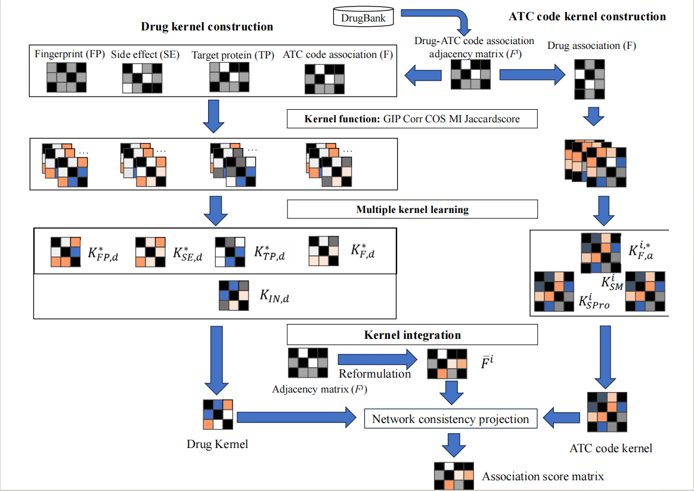
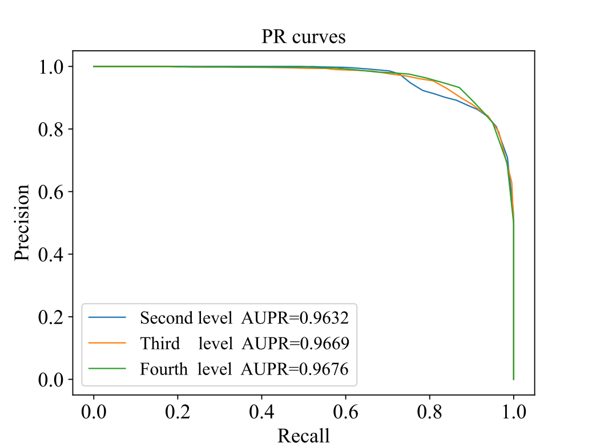
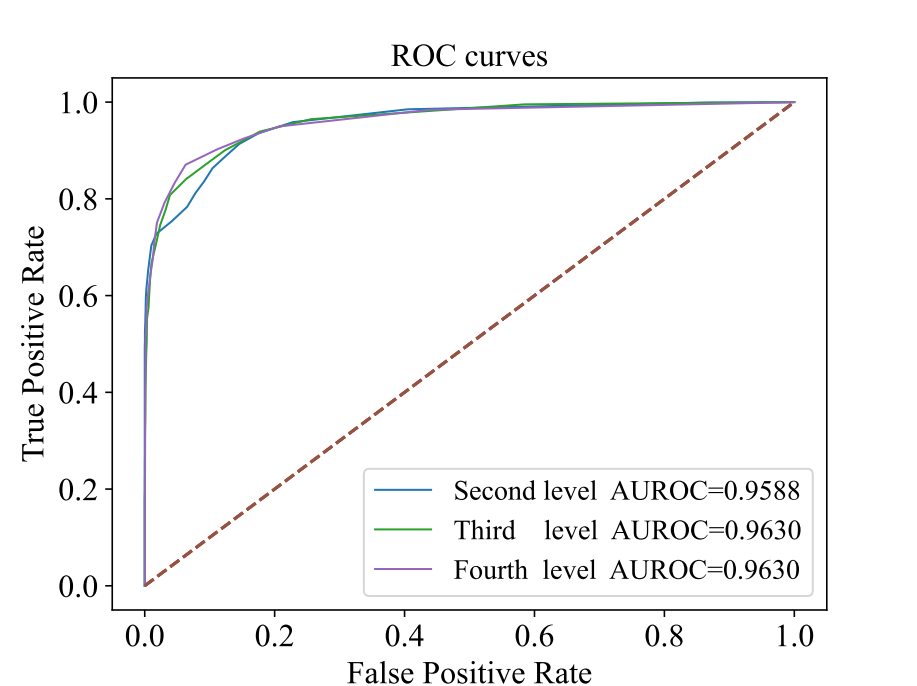

## PDATC-NCPMKL: Predicting drug’s Anatomical Therapeutic Chemical (ATC) codes based on network consistency projection and multiple kernel learning

This code is an implementation of our paper
"**PDATC-NCPMKL: Predicting drug’s Anatomical Therapeutic Chemical (ATC) codes based on network consistency projection and multiple kernel learning**"

We proposed a model PDATC-NCPMKL based on multiple kernel learning and network consistency projection algorithm. By integrating multi-source information of drugs (drug target protein, drug side effect, drug interaction, drug fingerprint, and drug-ATC code association), several drug kernels were constructed. In the same way, the ATC code kernels were set up. The drug and ATC code kernels were fused into a unified drug kernel and ATC code kernel by a multiple kernel learning algorithm and a kernel integrated scheme. On the other hand, the drug-ATC code association adjacency matrix was reformulated by a variant of **weighted K nearest known neighbors (WKNKN)**. Above kernels and matrix were fed into the network consistency projection to generate the association score matrix. The model was tested on the ATC codes at **the second, third and fourth levels** using **ten-fold cross-validation**. For detailed descriptions on the model and results, please refer to our article.




## Requirements

- python = 3.8
- cvxopt = 1.3.0
- cvxpy = 1.2.0
- ecos = 2.0.10
- fastcache = 1.1.0
- numpy+mkl = 1.22.4
- osqp = 0.6.2
- pandans = 1.3.5
- scikit-learn = 1.0.2
- scipy = 1.7.3
- scs = 3.2.0

## Files:

|filename|explain|
|:---|:---|
|new_2930_second_ATC.csv| The adjacency matrix of drugs and ATC codes at the second level. |
|new_2930_third_ATC.csv| The adjacency matrix of drugs and ATC codes at the third level. |
|new_2930_fourth_ATC.csv| The adjacency matrix of drugs and ATC codes at the fourth level. |
|2930_fingerprint.csv| The drug representation based on their fingerprints. |
|side_effects.csv| The drug representation based on their side effects. |
|uniprot.csv| The drug representation based on their target proteins. |
|interaction_kernel.csv| The drug kernel using the interaction information collected in STITCH. |

Drug SMILES information, drug ATC code information, and drug target protein information were obtained from **DrugBank** database (https://go.drugbank.com/), drug side effect information were obtained from **SIDER** database (http://sideeffects.emblde/), and drug interaction information was obtained from **STITCH** website (http://stitch4.embl.de/).


## Usage

### How to use it?

### 1. Use the data set we provide
### 1.1 Cross verification
If you use our dataset for cross-validation, all you need to do is enter the following command in the terminal:
```python
 python main.py
```
### 1.2 Modify model parameters
You just need to adjust the following code in the **main.py** file.
~~~python
if __name__ == "__main__":
    drug_atc_path = 'data/drug_ATC/new_2930_fourth_ATC.csv'
    op = Options(drug_atc_path=drug_atc_path, level=4, omega=0.9)
    op.train(k=10)
~~~
- **drug_atc_path** is the file path storing the adjacency matrix of drug and ATC codes.
- The parameter **level** represents the level of ATC codes. **It can be 2, 3 and 4**.
- The parameter **omega** represents parameter in WKNKN when reformulating the adjacency matrix. It can be any numbers **between 0.0 and 1.0**.
- The parameter **k** represents the number of folds in cross-validation. **k was set to 10 in our study**.

### 2. Use your own data set

### 2.1 Preprocessed data set

You need to prepare some files, which are all in CSV format. The detailed format is displayed as below:

#### 1. The adjacency matrix of drug-ATC code associations

|DrugBankID|code***1***|code***2***|code***3***|code***4***|...|code***m***|
|:----|:----|:----|:----|:----|:----|:----|
|drugID***1***|0|1|1|0|...|0|
|drugID***2***|1|0|0|1|...|0|
|drugID***3***|1|1|0|0|...|1|
|...|...|...|...|...|...|...|
|drugID***n***|0|0|1|1|...|0|

#### 2. Drug fingerprints matrix

|DrugBankID|F*1*|F*2*|F*3*|F*4*|...| 
|:---|:---|:---|:---|:---|:---|
|drugID***1***|0|1|1|0|...| 
|drugID***2***|1|0|0|1|...| 
|drugID***3***|1|1|0|0|...| 
|...|...|...|...|...|...| 
|drugID***n***|0|0|1|1|...|

#### 3. Drug interaction kernel

|DrugBankID|drugID***1***|drugID***2***|drugID***3***|drugID***4***|...|drugID***n***|
|:----|:----|:----|:----|:----|:----|:----|
|drugID***1***|1|0.3|0|0.75|...|0.33|
|drugID***2***|0.3|1|0.9|0.22|...|0.68|
|drugID***3***|0|0.9|1|0|...|0.47|
|drugID***4***|0.75|0.22|0|1|...|0.92|
|...|...|...|...|...|...|...|
|drugID***n***|0.33|0.68|0.47|0.92|...|1|

#### 4. Drug side effects matrix

|DrugBankID|side*1*|side*2*|side*3*|side*4*|...| 
|:---|:---|:---|:---|:---|:---|
|drugID***1***|1|0|0|1|...| 
|drugID***2***|1|1|0|0|...| 
|drugID***3***|0|0|0|1|...| 
|...|...|...|...|...|...| 
|drugID***n***|0|0|1|1|...|

#### 5. Drug target proteins matrix

|DrugBankID|target*1*|target*2*|target*3*|target*4*|...| 
|:---|:---|:---|:---|:---|:---|
|drugID***1***|0|1|0|1|...| 
|drugID***2***|1|0|0|0|...| 
|drugID***3***|0|0|1|1|...| 
|...|...|...|...|...|...| 
|drugID***n***|0|0|1|0|...|

#### 6. Because it involves ATC code tree structure to find the shortest path, different data sets involve different ATC, so you should prepare the shortest path file for ATC codes at different levels. It is also in CSV format, as shown below

||ATCcode***1***|ATCcode***2***|ATCcode***3***|ATCcode***4***|...|ATCcode***m***|
|:----|:----|:----|:----|:----|:----|:----|
|ATCcode***1***|0|2|2|4|...|4|
|ATCcode***2***|2|0|2|8|...|6|
|ATCcode***3***|2|2|0|4|...|8|
|ATCcode***4***|4|8|4|0|...|2|
|...|...|...|...|...|...|...|
|ATCcode***m***|4|6|8|2|...|0|
- You should put this file in the **PDATC-NCPMKL/shortest_path/** folder, and it should have **the same file name as mine**. (**For example, the second level ATC code file is named new_2ATC_shortest_path_length_matrix.csv**)
- In addition, in order to prevent the accuracy of SPro kernel matrix calculation, ensure that the **order of ATCcode** here is consistent with that in **the adjacency matrix of drug-ATC code**.

### 2.2 Cross verification
You just need to modify the following code in the **main.py** file to run it:
~~~python
def file_path(self):
    drug_fingerprint_path = 'your own drug fingerprint file path'
    drug_side_effects_path = 'your own drug side effect file path'
    drug_target_protein_path = 'your own drug target protein file path'
    drug_interaction_path = 'your own drug interaction file path'
    return drug_fingerprint_path, drug_side_effects_path, drug_target_protein_path, drug_interaction_path
~~~
~~~python
if __name__ == "__main__":
    drug_atc_path = 'your drug-ATC code adjacency matrix file path'
    op = Options(drug_atc_path=drug_atc_path, level=4, omega=0.9)
    op.train(k=10)
~~~

### The results predicted by the model
After running our model, the **PDATC-NCPMKL_predict.csv** file and **PDATC-NCPMKL_actual.csv** file will be generated, where the **PDATC-NCPMKL_predict.csv** file will store the **predicted score**, the **actual value** is saved in the **PDATC-NCPMKL_actual.csv** file.


## Result
The PR curves and ROC curves predicted by our model on the dataset are shown below:
1. The PR curves

2. The ROC curves


